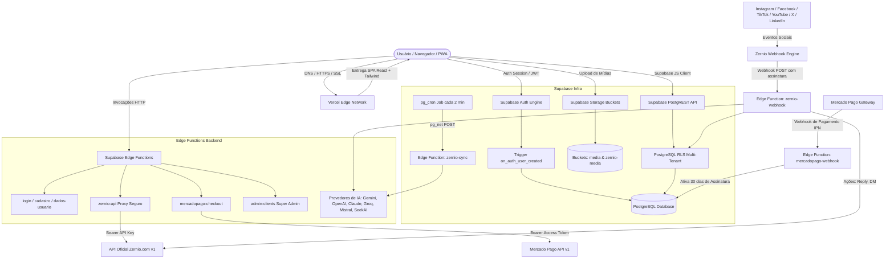
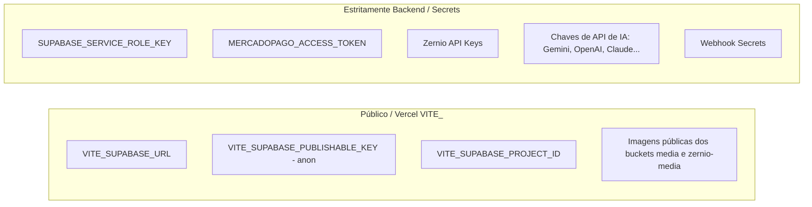

# MANUAL TÉCNICO DE AUDITORIA, IMPLANTAÇÃO E DEPLOY — PLATAFY SOCIAL HUB

> **Destinatário:** Engenheiro de Software / Antigravity Executor  
> **Objetivo:** Guia definitivo de implantação ponta a ponta para reproduzir a instalação do **PLATAFY Social Hub** do zero até a produção para novos clientes, baseado exclusivamente na arquitetura real auditada neste repositório.

---

## 1. VISÃO GERAL DO PROJETO

O **PLATAFY Social Hub** é uma plataforma SaaS multi-tenant para gestão de redes sociais, agendamento de publicações, atendimento unificado via Direct Messages e Comentários (Inbox), automação com Inteligência Artificial (comentários e DMs) e CRM de contatos.

### Pilha Tecnológica Real
- **Frontend:** React 19.2 + TypeScript (strict mode) + Vite 8.1 + Tailwind CSS v4 + Radix UI / Sonner.
- **Roteamento:** React Router DOM com `HashRouter` (garante compatibilidade estática em qualquer CDN).
- **Backend Serverless:** Supabase Edge Functions (Deno runtime).
- **Banco de Dados:** PostgreSQL 15+ (Supabase) com Row Level Security (RLS) estrito e triggers automáticos.
- **Extensões PostgreSQL:** `pg_cron`, `pg_net`, `uuid-ossp`, `pgcrypto`.
- **Armazenamento de Mídia:** Supabase Storage (Buckets públicos `media` e `zernio-media`).
- **Autenticação:** Supabase Auth (Email/Senha + Google OAuth + Magic Link/Recuperação de Senha).
- **Motor de Redes Sociais:** Zernio API v1 (Profiles, Accounts, Posts, Inbox DMs, Inbox Comments, Contacts, Analytics).
- **Billing / Assinaturas:** Mercado Pago Checkout Pro (Preferences API) + Webhook de Pagamentos Automáticos + Licenças Manuais via Super Admin.
- **Hospedagem Frontend & CDN:** Vercel com CI/CD acoplado ao GitHub.

---

## 2. ARQUITETURA DO PLATAFY SOCIAL HUB

### Fluxo Completo de Comunicação e Dados



---

## 3. GITHUB E ESTRUTURA DO REPOSITÓRIO

### Informações do Repositório
- **Repositório Atual:** `https://github.com/platafy/platafy_social_hub.git`
- **Branch Principal / Produção:** `main`
- **Gerenciador de Pacotes:** `npm` (Lockfile: `package-lock.json`)

### Árvore de Diretórios Essencial

```
platafy_social_hub/
├── .env.example                     # Modelo de variáveis de ambiente frontend
├── generate-schedulers.js           # Script de geração automática do SQL de cron
├── index.html                       # Entrypoint HTML com meta tags PWA e no-referrer
├── package.json                     # Manifesto de dependências e scripts Vite
├── tsconfig.json                    # Configuração TypeScript
├── vite.config.ts                   # Configuração Vite com alias "@" -> "./src"
├── public/
│   ├── Criar-Conta.mp4              # Vídeo tutorial de onboarding
│   ├── login-bg.webp                # Imagem de fundo padrão do login
│   ├── logo.png / favicon.png       # Logos e ícones padrão
│   ├── manifest.webmanifest         # Manifesto PWA
│   └── sw.js                        # Service Worker para suporte PWA
├── scratch/
│   └── prebuild.js                  # Script de pré-compilação para sincronizar IDs
├── src/
│   ├── App.tsx                      # HashRouter, Layout, Header, Rotas e ThemeProvider
│   ├── main.tsx                     # Bootstrap do React 19
│   ├── components/
│   │   ├── BrandLogo.tsx            # Componente de marca dinâmico (sm, md, lg, xl, 2xl)
│   │   ├── InstallPwaPrompt.tsx     # Notificação de instalação PWA
│   │   ├── ProtectedRoute.tsx       # Controle de acesso por autenticação e assinatura
│   │   ├── SubscriptionBanner.tsx   # Alerta de dias restantes de trial/assinatura
│   │   ├── ThemeToggle.tsx          # Alternador de tema claro/escuro
│   │   ├── admin/
│   │   │   ├── SuperAdminClients.tsx # Gestão de clientes, planos e licenças manuais
│   │   │   └── SuperAdminPlans.tsx   # Editor de planos e limites
│   │   ├── settings/
│   │   │   ├── MercadoPagoSettings.tsx # Credenciais e webhook do Mercado Pago
│   │   │   └── WhiteLabelSettings.tsx  # Personalização de marca, login e cores
│   │   └── ui/                      # Componentes Radix / Tailwind (Button, Card, Input...)
│   ├── contexts/
│   │   ├── AuthContext.tsx          # Autenticação, tenant_id, papéis e Super Admin
│   │   ├── BrandingContext.tsx      # Identidade visual global e tenant
│   │   ├── SubscriptionContext.tsx  # Limites de planos, checkout e status de acesso
│   │   └── ThemeContext.tsx         # Tema persistido no localStorage (dark/light)
│   ├── integrations/supabase/
│   │   ├── client.ts                # Inicializador do cliente Supabase
│   │   └── types.ts                 # Tipos TypeScript gerados
│   ├── lib/
│   │   └── zernio.ts                # SDK cliente Zernio com cache em memória e sessionStorage
│   └── pages/
│       ├── AuthError.tsx            # Tela de erro de autenticação
│       ├── Cadastro.tsx             # Criação de conta com auto-provisionamento
│       ├── Home.tsx                 # Dashboard principal unificado (Posts, Inbox, IA, CRM)
│       ├── Login.tsx                # Tela de login split-screen moderna
│       ├── NotFound.tsx             # 404
│       ├── Planos.tsx               # Tabela pública de planos e checkout Mercado Pago
│       └── RecuperarSenha.tsx       # Solicitação e redefinição de senha
└── supabase/
    ├── config.toml                  # Configuração de projeto e declaração de Edge Functions
    ├── functions/                   # 11 Edge Functions Deno
    │   ├── admin-clients/
    │   ├── cadastro/
    │   ├── dados-usuario/
    │   ├── login/
    │   ├── mercadopago-checkout/
    │   ├── mercadopago-webhook/
    │   ├── recuperacao-senha/
    │   ├── zernio-api/
    │   ├── zernio-contacts-sync/
    │   ├── zernio-sync/
    │   └── zernio-webhook/
    └── migrations/                  # 21 Migrações SQL versionadas
```

---

## 4. VERCEL — CONFIGURAÇÃO E ENVIRONMENT VARIABLES

### Configurações de Build na Vercel
- **Framework Preset:** `Vite`
- **Build Command:** `node generate-schedulers.js && node scratch/prebuild.js && tsc -b && vite build`
- **Output Directory:** `dist`
- **Install Command:** `npm install` (o `postinstall` executa `node generate-schedulers.js`)
- **Node.js Version:** `20.x` (ou superior)

### Tabela de Variáveis de Ambiente da Vercel

| Variável | Obrigatória? | Onde é utilizada? | Onde configurar? | Finalidade |
| :--- | :--- | :--- | :--- | :--- |
| `VITE_SUPABASE_URL` | **Sim** | Frontend (todos os serviços) | Vercel (Production / Preview) | URL base da API do projeto Supabase (`https://<project-id>.supabase.co`) |
| `VITE_SUPABASE_PUBLISHABLE_KEY` | **Sim** | Frontend (Supabase Client) | Vercel (Production / Preview) | Chave pública `anon` do Supabase |
| `VITE_SUPABASE_PROJECT_ID` | **Sim** | Build Script (`scratch/prebuild.js`) | Vercel (Production / Preview) | ID de referência do projeto Supabase (ex: `sabzbazyxfxorrfshhgf`) |

> [!IMPORTANT]
> **NUNCA** adicione `SUPABASE_SERVICE_ROLE_KEY` na Vercel. O frontend do Vite expõe todas as variáveis prefixadas com `VITE_` no bundle do navegador. A Service Role Key deve ficar estritamente nos Secrets do Supabase.

---

## 5. SUPABASE — AUDITORIA COMPLETA DO BANCO DE DADOS

### Configuração Geral do Projeto
- **Project ID Atual:** `sabzbazyxfxorrfshhgf`
- **Região Recomendada:** `sa-east-1` (São Paulo, Brasil) para menor latência com clientes locais.

### Configuração de Autenticação (Auth)
1. **Providers Habilitados:** Email/Senha (padrão) e opcionalmente Google OAuth.
2. **Site URL:** `https://socialhub.platafy.com` (substituir pelo domínio de produção do cliente).
3. **Redirect URLs:**
   - `https://socialhub.platafy.com/**`
   - `https://socialhub.platafy.com/#/**`
   - `http://localhost:5173/**` (para desenvolvimento local)
4. **Email Confirmation:** A Edge Function `cadastro` pré-confirma os usuários via `email_confirm: true`. Para fluxo direto pelo Supabase Auth, configurar SMTP corporativo (SendGrid, Resend ou Amazon SES).

### Mapeamento Completo das 18 Tabelas

| Tabela | Colunas Principais | Relações / FKs | Finalidade |
| :--- | :--- | :--- | :--- |
| `tenants` | `id (PK, uuid)`, `name (text)`, `branding (jsonb)`, `created_at` | Raiz da hierarquia | Isolamento de dados multi-tenant |
| `profiles` | `id (PK, uuid)`, `tenant_id (FK)`, `email (text)`, `full_name`, `phone`, `created_at`, `updated_at` | `auth.users(id)`, `tenants(id)` | Dados cadastrais e vínculo do usuário ao tenant |
| `user_roles` | `id (PK, uuid)`, `user_id (FK)`, `tenant_id (FK)`, `role (app_role)`, `created_at` | `auth.users(id)`, `tenants(id)` | Controle de acesso por papel (`admin`, `member`) |
| `plans` | `id (PK, uuid)`, `name`, `slug (unique)`, `price`, `currency`, `interval`, `features (jsonb)`, `limits (jsonb)`, `is_popular`, `is_active` | - | Definição comercial de planos e cotas |
| `subscriptions` | `id (PK, uuid)`, `tenant_id (FK, unique)`, `plan_id (FK)`, `status`, `billing_type`, `payment_method`, `trial_ends_at`, `current_period_start`, `current_period_end`, `last_payment_date`, `notes` | `tenants(id)`, `plans(id)` | Estado da licença de uso do tenant |
| `payment_history` | `id (PK, uuid)`, `tenant_id (FK)`, `plan_id (FK)`, `amount`, `currency`, `payment_method`, `status`, `mercadopago_payment_id`, `receipt_url`, `created_at` | `tenants(id)`, `plans(id)` | Histórico contábil de transações |
| `platform_settings` | `id (PK, uuid)`, `mercadopago_access_token`, `mercadopago_public_key`, `mercadopago_webhook_secret`, `trial_days`, `updated_at` | - | Configurações globais administrativas do Mercado Pago |
| `platform_branding` | `id (PK, int = 1)`, `branding (jsonb)`, `updated_at` | - | Identidade visual global padrão da aplicação |
| `admin_audit_logs` | `id (PK, uuid)`, `admin_email`, `target_tenant_id (FK)`, `target_user_id (FK)`, `action`, `details (jsonb)`, `created_at` | `tenants(id)`, `auth.users(id)` | Trilha de auditoria das ações do Super Admin |
| `zernio_integrations`| `id (PK, uuid)`, `tenant_id (FK)`, `name`, `api_key`, `zernio_profile_id`, `ai_gemini_key`, `ai_openai_key`, `ai_anthropic_key`, `ai_mistral_key`, `ai_groq_key`, `ai_seekai_key` | `tenants(id)` | Chaves de API Zernio e credenciais de IA por tenant |
| `zernio_integration_channels` | `id (PK, uuid)`, `tenant_id (FK)`, `integration_id (FK)`, `social_account_id`, `platform`, `account_name`, `created_at` | `tenants(id)`, `zernio_integrations(id)` | Vínculo explícito entre conta social conectada e integração |
| `zernio_posts` | `id (PK, uuid)`, `tenant_id (FK)`, `zernio_post_id`, `text`, `status`, `scheduled_at`, `created_by (FK)`, `platforms (jsonb)`, `zernio_integration_id (FK)` | `tenants(id)`, `profiles(id)` | Cache local de publicações e agendamentos |
| `zernio_automations` | `id (PK, uuid)`, `tenant_id (FK)`, `social_account_id`, `platform`, `is_enabled`, `trigger_type`, `keywords (text[])`, `automation_type`, `ai_provider`, `static_reply`, `target_posts_type`, `target_post_ids (text[])` | `tenants(id)` | Regras de automação de comentários e DMs |
| `zernio_automation_rules` | `id (PK, uuid)`, `tenant_id (FK)`, `name`, `trigger_type`, `action_type`, `conditions (jsonb)`, `actions (jsonb)`, `is_active` | `tenants(id)` | Regras adicionais de automação multi-condição |
| `zernio_automation_dedup` | `id (PK, uuid)`, `event_fingerprint (unique)`, `processed_at` | - | Deduplicação de eventos para evitar respostas duplicadas |
| `zernio_automation_logs` | `id (PK, uuid)`, `tenant_id (FK)`, `social_account_id`, `external_id`, `platform`, `event_type`, `status`, `sender_username`, `content`, `reply_sent`, `error_message`, `raw_payload (jsonb)` | `tenants(id)` | Logs detalhados de execução das automações |
| `contacts` | `id (PK, uuid)`, `tenant_id (FK)`, `name`, `email`, `phone`, `tags (text[])`, `created_at` | `tenants(id)` | Contatos legados da base |
| `zernio_contacts` | `id (PK, uuid)`, `tenant_id (FK)`, `zernio_contact_id`, `profile_id`, `integration_id`, `name`, `email`, `phone`, `avatar_url`, `tags (text[])`, `platforms (text[])`, `last_interaction_at`, `raw_data (jsonb)` | `tenants(id)` | CRM de contatos sincronizado com o Zernio |

---

## 6. ROW LEVEL SECURITY (RLS) E POLICIES

A segurança multi-tenant é garantida na camada de banco via funções de segurança `SECURITY DEFINER`:

### Funções Auxiliares de RLS
```sql
-- 1. Obtém o tenant_id do usuário logado sem disparar recursão
CREATE OR REPLACE FUNCTION public.get_user_tenant(_user_id UUID)
RETURNS UUID
LANGUAGE SQL STABLE SECURITY DEFINER SET search_path = public AS $$
  SELECT tenant_id FROM public.profiles WHERE id = _user_id LIMIT 1;
$$;

-- 2. Verifica se o usuário possui um papel específico
CREATE OR REPLACE FUNCTION public.has_role(_user_id UUID, _role public.app_role)
RETURNS BOOLEAN
LANGUAGE SQL STABLE SECURITY DEFINER SET search_path = public AS $$
  SELECT EXISTS (
    SELECT 1 FROM public.user_roles WHERE user_id = _user_id AND role = _role
  );
$$;

-- 3. Identifica se a sessão pertence ao Super Admin oficial
CREATE OR REPLACE FUNCTION public.is_super_admin()
RETURNS BOOLEAN
LANGUAGE sql STABLE SECURITY DEFINER SET search_path = public AS $$
  SELECT (auth.jwt() ->> 'email' = 'suporte@platafy.com');
$$;
```

### Regras de Isolamento por Tabela

1. **`tenants`:**
   - `SELECT`: `id = public.get_user_tenant(auth.uid())` ou `public.is_super_admin()`.
   - `UPDATE`: Somente o admin do próprio tenant ou Super Admin.

2. **`profiles`:**
   - `SELECT`: Próprio perfil (`id = auth.uid()`), usuários do mesmo tenant (`tenant_id = public.get_user_tenant(auth.uid())`) ou Super Admin.
   - `UPDATE`: Próprio usuário (`id = auth.uid()`) ou Super Admin.

3. **`subscriptions`:**
   - `SELECT`: Tenant proprietário ou Super Admin.
   - `UPDATE/INSERT`: Super Admin tem permissão irrestrita; tenant só pode atualizar se possuir papel `admin`.

4. **`plans`:**
   - `SELECT`: Público (`is_active = true`).
   - `INSERT/UPDATE/DELETE`: Exclusivo para Super Admin (`suporte@platafy.com`).

5. **`platform_settings`:**
   - `SELECT/UPDATE`: Acesso estritamente restrito ao Super Admin (`auth.jwt() ->> 'email' = 'suporte@platafy.com'`).

6. **`platform_branding`:**
   - `SELECT`: Público para qualquer visitante/usuário autenticado.
   - `UPDATE`: Exclusivo do Super Admin (`suporte@platafy.com`).

7. **Tabelas de Operação Zernio (`zernio_integrations`, `zernio_posts`, `zernio_automations`, `zernio_integration_channels`, `zernio_automation_logs`):**
   - Todas isoladas por `tenant_id = public.get_user_tenant(auth.uid())`.

---

## 7. SUPABASE STORAGE (BUCKETS DE MÍDIA)

A plataforma utiliza dois buckets públicos para armazenamento e distribuição de imagens, vídeos e arquivos de marca:

1. **Bucket `media`:** Armazena logos de clientes, favicons, imagens de login customizadas e mídias gerais.
2. **Bucket `zernio-media`:** Armazena imagens e vídeos gerados para posts e agendamentos que precisam ser consumidos publicamente pela API do Zernio.

### Script SQL para Criação dos Buckets e Políticas de Acesso
```sql
CREATE EXTENSION IF NOT EXISTS "uuid-ossp";

-- Criar buckets com limite de 50MB por arquivo
INSERT INTO storage.buckets (id, name, public, file_size_limit, allowed_mime_types)
VALUES 
  ('zernio-media', 'zernio-media', true, 52428800, null),
  ('media', 'media', true, 52428800, null)
ON CONFLICT (id) DO UPDATE SET 
  public = true,
  file_size_limit = 52428800;

-- Políticas de Leitura Pública
CREATE POLICY "Public Read Access on zernio-media" ON storage.objects
  FOR SELECT USING (bucket_id = 'zernio-media');

CREATE POLICY "Public Read Access on media" ON storage.objects
  FOR SELECT USING (bucket_id = 'media');

-- Políticas de Upload (Permite autenticados e anônimos para flexibilidade no onboarding)
CREATE POLICY "Allow Insert on zernio-media" ON storage.objects
  FOR INSERT TO authenticated, anon WITH CHECK (bucket_id = 'zernio-media');

CREATE POLICY "Allow Update on zernio-media" ON storage.objects
  FOR UPDATE TO authenticated, anon USING (bucket_id = 'zernio-media');

CREATE POLICY "Allow Delete on zernio-media" ON storage.objects
  FOR DELETE TO authenticated, anon USING (bucket_id = 'zernio-media');

CREATE POLICY "Allow Insert on media" ON storage.objects
  FOR INSERT TO authenticated, anon WITH CHECK (bucket_id = 'media');

CREATE POLICY "Allow Update on media" ON storage.objects
  FOR UPDATE TO authenticated, anon USING (bucket_id = 'media');

CREATE POLICY "Allow Delete on media" ON storage.objects
  FOR DELETE TO authenticated, anon USING (bucket_id = 'media');
```

---

## 8. EDGE FUNCTIONS / BACKEND SERVERLESS

O projeto conta com **11 Edge Functions** em TypeScript (Deno runtime). Nenhuma delas expõe chaves secretas para o frontend.

| Edge Function | Disparo / Invocação | Permissão / JWT | Finalidade e Dependências |
| :--- | :--- | :--- | :--- |
| `login` | `POST /functions/v1/login` | Aberto (`verify_jwt = false`) | Autentica email/senha via `signInWithPassword` e retorna perfil e tenant enriquecidos. |
| `cadastro` | `POST /functions/v1/cadastro` | Aberto (`verify_jwt = false`) | Cria usuário com `email_confirm: true` usando a Service Role Key, disparando o auto-provisionamento do tenant. |
| `dados-usuario` | `GET/POST /functions/v1/dados-usuario` | Requer Token JWT no header | Retorna o `tenant_id` e a lista de `roles` associados ao usuário logado. |
| `recuperacao-senha`| `POST /functions/v1/recuperacao-senha` | Aberto (`verify_jwt = false`) | Dispara email oficial de recuperação com link de redirecionamento seguro. |
| `admin-clients` | `POST /functions/v1/admin-clients` | Restrito ao Super Admin | Gestão completa de clientes: criação manual, upgrade/downgrade de planos, suspensão/reativação e auditoria. |
| `mercadopago-checkout` | `POST /functions/v1/mercadopago-checkout` | Usuário Autenticado | Cria preferência de pagamento no Mercado Pago com `external_reference` contendo `{tenant_id, plan_id}`. |
| `mercadopago-webhook` | `POST /functions/v1/mercadopago-webhook` | Webhook Mercado Pago | Recebe IPN de pagamento, consulta a API do Mercado Pago e ativa a assinatura do tenant por 30 dias se aprovado. |
| `zernio-api` | Vários métodos em `/zernio-api/*` | Usuário Autenticado | Proxy seguro para a API do Zernio; valida cota de Perfis Ativos e mascara a chave de API do tenant. |
| `zernio-sync` | `pg_cron` a cada 2 min / manual | Interno / Service Role | Sincroniza comentários do YouTube/TikTok, executa regras e responde via IA ou resposta estática. |
| `zernio-contacts-sync`| `POST /functions/v1/zernio-contacts-sync`| Usuário Autenticado | Pagina contatos da API do Zernio e realiza upsert em lote na tabela `zernio_contacts`. |
| `zernio-webhook` | `POST /functions/v1/zernio-webhook` | Webhook do Zernio | Processa em tempo real comentários e DMs recebidos, executando automações com deduplicação. |

---

## 9. ZERNIO — INTEGRAÇÃO COM REDES SOCIAIS

O Zernio (`https://zernio.com`) é a infraestrutura de conexão com as APIs oficiais do Instagram, Facebook, TikTok, YouTube, LinkedIn, X/Twitter, Pinterest e Threads.

### Como Funciona a Integração
1. **Credencial:** Cada tenant insere sua API Key do Zernio (obtida em `https://zernio.com/dashboard/api-keys`). A chave é armazenada de forma segura na tabela `zernio_integrations`.
2. **Perfis no Zernio:** A conta Zernio organiza as redes em "Profiles" (Perfis). Cada perfil agrupa as contas conectadas de um cliente ou marca.
3. **Conexão de Redes:** A plataforma solicita a URL de autorização via `GET /api/v1/connect/{platform}?profileId={profileId}` e abre a janela de OAuth oficial da rede social.
4. **Mapeamento de Canais:** Quando uma conta é conectada, seu `social_account_id` é registrado na tabela `zernio_integration_channels` vinculado ao `tenant_id` e `integration_id`.
5. **Configuração de Webhooks no Zernio:**
   - **URL do Webhook:** `https://<project-id>.supabase.co/functions/v1/zernio-webhook`
   - **Eventos Assinados:** `comment.received`, `comment.created`, `message.received`, `message.created`.

---

## 10. REGRA COMERCIAL DE PERFIS ATIVOS

> [!IMPORTANT]
> **Definição Técnica e Comercial:**  
> **1 Perfil Ativo = 1 Profile no Zernio**, que permite conectar **até 2 contas sociais** (ex: 1 Instagram + 1 Facebook).  
> A plataforma não cobra por postagem individual, mas sim pelo número de **Perfis Ativos** contratados no plano.

### Como o Sistema Aplica e Bloqueia o Limite
Na Edge Function `zernio-api/index.ts` (linhas 314-369), ao interceptar a criação de um novo perfil (`POST /v1/profiles`):
1. O backend consulta o plano atual do tenant na tabela `subscriptions` e `plans`.
2. Extrai `limits.max_profiles`.
3. Se `max_profiles !== -1` (não ilimitado):
   - Consulta todas as integrações do tenant e busca a contagem real de perfis ativos via API do Zernio (`GET /v1/profiles`).
   - Se `totalActiveProfiles >= maxProfiles`, a requisição é **bloqueada imediatamente com HTTP 403 Forbidden**:
     ```json
     {
       "success": false,
       "error": "Limite de Perfis Ativos atingido (X/Y). Cada Perfil Ativo permite conectar até 2 contas no Zernio. Faça upgrade do seu plano para criar novos perfis."
     }
     ```

---

## 11. PLANOS E PRECIFICAÇÃO REAL AUDITADA

Os valores e limites reais configurados no banco de dados e no código (`SubscriptionContext.tsx` e `20260717000000_active_profiles_limit.sql`) são:

| Plano | Preço Mensal | Perfis Ativos Permitidos | Total Contas Sociais | Agendamentos | Automação IA | White Label |
| :--- | :--- | :--- | :--- | :--- | :--- | :--- |
| **Starter** | **R$ 47,00** | **1 Perfil Ativo** | Até 2 contas | 50 posts/mês | Não | Não |
| **Pro** (Popular) | **R$ 97,00** | **5 Perfis Ativos** | Até 10 contas | Ilimitado | Sim (Todas as LLMs) | Não |
| **Agência** | **R$ 197,00** | **Ilimitado (-1)** | Ilimitado (-1) | Ilimitado | Sim (Todas as LLMs) | Sim (Completo) |

---

## 12. MERCADO PAGO — FLUXO DE PAGAMENTO E RENOVAÇÃO

### Onde Configurar
O Super Admin configura o **Access Token de Produção** do Mercado Pago diretamente no painel administrativo em **Configurações → Mercado Pago** (armazenado em `platform_settings.mercadopago_access_token`) ou via secret `MERCADOPAGO_ACCESS_TOKEN` no Supabase.

### Ciclo de Vida da Assinatura
1. **Checkout:** O cliente clica em "Assinar" na página `/planos`. A função `mercadopago-checkout` cria a preferência com `external_reference = JSON.stringify({ tenant_id, plan_id, user_id })`.
2. **Notificação:** O Mercado Pago envia a notificação IPN para `https://<project-id>.supabase.co/functions/v1/mercadopago-webhook`.
3. **Validação:** O webhook consulta a API do Mercado Pago (`GET /v1/payments/{id}`) para verificar o status real.
4. **Ativação:** Se `status === 'approved'`:
   - A assinatura do tenant é ativada por **30 dias** (`current_period_end = now() + 30 days`).
   - Se o tenant já possuía vigência manual maior concedida pelo Super Admin, o sistema preserva o prazo mais favorável ao cliente.
   - Um registro contábil de pagamento aprovado é gravado em `payment_history`.

---

## 13. DOMÍNIO E DNS — CONFIGURAÇÃO DE PRODUÇÃO

Para apontar um domínio personalizado (exemplo: `social.novocliente.com` ou `app.novocliente.com`):

### 1. Entradas de DNS na Zona do Domínio (Cloudflare, GoDaddy, Registro.br, etc.)

| Tipo | Nome / Host | Conteúdo / Destino | Proxy / TTL |
| :--- | :--- | :--- | :--- |
| **CNAME** | `social` (ou `app`) | `cname.vercel-dns.com` | DNS Only (se Cloudflare, nuvem cinza) / TTL Automático |
| **A** (se for ápice `dominio.com`) | `@` | `76.76.21.21` | DNS Only / TTL Automático |

### 2. Configuração na Vercel
- Em **Project Settings → Domains**, adicione o domínio configurado (ex: `social.novocliente.com`).
- A Vercel emitirá o certificado SSL Let's Encrypt automaticamente em até 5 minutos.

### 3. Configuração no Supabase Auth
- Em **Authentication → URL Configuration**:
  - **Site URL:** `https://social.novocliente.com`
  - **Redirect URLs:** Adicionar `https://social.novocliente.com/**` e `https://social.novocliente.com/#/**`.

---

## 14. GUIA DE INSTALAÇÃO PASSO A PASSO (DO ZERO À PRODUÇÃO)

> **Instruções para o Antigravity executor:** Siga rigorosamente as 28 etapas abaixo para implantar a plataforma para um novo cliente.

### ETAPA 1 — Preparar Contas e Pré-requisitos
- Conta no GitHub com acesso para clonar ou forkar o repositório.
- Conta na Vercel vinculada ao GitHub.
- Conta no Supabase (`https://supabase.com`).
- Conta no Zernio (`https://zernio.com`) com plano ativo e API Key gerada.
- Conta comercial no Mercado Pago com credenciais de produção (Access Token).
- Domínio ou subdomínio do cliente pronto para receber as entradas de DNS.

### ETAPA 2 — Criar Novo Projeto no Supabase
1. No painel do Supabase, clique em **New Project**.
2. Defina o nome do projeto (ex: `cliente-social-hub`).
3. Gere uma senha de banco segura e guarde-a.
4. Escolha a região mais próxima (ex: `São Paulo (sa-east-1)`).
5. Copie as credenciais geradas em **Project Settings → API**:
   - `Project Ref / ID`
   - `Project URL`
   - `anon / public key`
   - `service_role key` (mantenha secreta)

### ETAPA 3 — Conectar a CLI do Supabase ao Projeto
No terminal do projeto local:
```powershell
# Efetuar login no Supabase CLI
npx supabase login

# Vincular ao novo projeto remoto
npx supabase link --project-ref <NOVO_PROJECT_ID>
```

### ETAPA 4 — Executar as Migrações SQL
Execute todas as 21 migrações para subir o schema completo:
```powershell
npx supabase db push
```

### ETAPA 5 — Configurar Extensões e Cron de Sincronização
Gere o arquivo do cron com o novo Project ID:
```powershell
node generate-schedulers.js
```
Em seguida, aplique a migração gerada no banco remoto:
```powershell
npx supabase db push
```

### ETAPA 6 — Validar RLS e Segurança
Confirme que todas as 18 tabelas possuem Row Level Security ativo e policies atribuídas conforme documentado na Seção 6 deste manual.

### ETAPA 7 — Criar Buckets de Storage
Verifique se os buckets `media` e `zernio-media` foram criados como públicos:
```powershell
npx supabase db query --linked "SELECT id, name, public FROM storage.buckets;"
```
Caso necessário, re-execute o script `supabase/migrations/20260719000000_storage_buckets.sql`.

### ETAPA 8 — Configurar Supabase Auth
1. Vá em **Authentication → Providers → Email** e confirme que está ativo.
2. Em **Authentication → URL Configuration**:
   - Defina o **Site URL** para o domínio oficial de produção.
   - Adicione as Redirect URLs com suporte a rotas hash: `https://<dominio-cliente>/#/**`.

### ETAPA 9 — Deploy das 11 Edge Functions
No terminal, faça o deploy das funções serverless:
```powershell
npx supabase functions deploy admin-clients --no-verify-jwt
npx supabase functions deploy cadastro --no-verify-jwt
npx supabase functions deploy dados-usuario --no-verify-jwt
npx supabase functions deploy login --no-verify-jwt
npx supabase functions deploy mercadopago-checkout --no-verify-jwt
npx supabase functions deploy mercadopago-webhook --no-verify-jwt
npx supabase functions deploy recuperacao-senha --no-verify-jwt
npx supabase functions deploy zernio-api --no-verify-jwt
npx supabase functions deploy zernio-contacts-sync --no-verify-jwt
npx supabase functions deploy zernio-sync --no-verify-jwt
npx supabase functions deploy zernio-webhook --no-verify-jwt
```

### ETAPA 10 — Configurar Secrets no Supabase (Opcional / Fallbacks)
Se desejar fornecer chaves globais de IA para automação:
```powershell
npx supabase secrets set GEMINI_API_KEY=<INSERIR_VALOR_SEGURO>
npx supabase secrets set OPENAI_API_KEY=<INSERIR_VALOR_SEGURO>
```

### ETAPA 11 — Configurar Zernio
1. Acesse `https://zernio.com/dashboard/webhooks`.
2. Cadastre a URL do webhook do novo projeto:
   `https://<NOVO_PROJECT_ID>.supabase.co/functions/v1/zernio-webhook`
3. Habilite todos os eventos de comentários e DMs (`comment.received`, `comment.created`, `message.received`, `message.created`).

### ETAPA 12 — Configurar Mercado Pago
1. Acesse o portal de desenvolvedores do Mercado Pago.
2. Em Webhooks / Notificações IPN, cadastre a URL:
   `https://<NOVO_PROJECT_ID>.supabase.co/functions/v1/mercadopago-webhook`
3. Selecione o tópico **Pagamentos (Payments)**.

### ETAPA 13 — Criar Projeto na Vercel
1. Acesse `https://vercel.com/new`.
2. Importe o repositório GitHub do cliente.
3. Framework Preset: `Vite`.

### ETAPA 14 — Configurar Environment Variables na Vercel
Adicione nas configurações do projeto na Vercel:
- `VITE_SUPABASE_URL` = `https://<NOVO_PROJECT_ID>.supabase.co`
- `VITE_SUPABASE_PUBLISHABLE_KEY` = `<NOVA_ANON_KEY>`
- `VITE_SUPABASE_PROJECT_ID` = `<NOVO_PROJECT_ID>`

### ETAPA 15 — Realizar Deploy na Vercel
Clique em **Deploy**. Acompanhe o log para confirmar a execução dos scripts de prebuild e da compilação com `built in Xs`.

### ETAPA 16 — Configurar Domínio Personalizado
Na Vercel, adicione o domínio do cliente e aponte os registros CNAME/A no DNS conforme Seção 13.

### ETAPA 17 — Testar Acesso Inicial
Abra o domínio no navegador. A página deverá carregar com o alerta de configuração ausente desativado e o formulário de login visível.

### ETAPA 18 — Criar a Conta do Super Admin Oficial
1. Acesse a rota `/#/cadastro`.
2. Cadastre o usuário com o email oficial de Super Admin definido no código (`suporte@platafy.com` ou o email configurado em `AuthContext.tsx` e `is_super_admin()`).
3. O trigger `handle_new_user` criará o tenant administrativo e o papel `admin`.

### ETAPA 19 — Configurar White Label da Aplicação
1. Faça login com a conta de Super Admin.
2. Abra a aba lateral **Configurações → White Label**.
3. Configure o Nome da Plataforma, Tagline, Logo, Favicon, Imagem de Fundo do Login e cores primárias.
4. Salve as alterações. O registro em `platform_branding` será atualizado em tempo real para todos os usuários.

### ETAPA 20 — Configurar Credenciais do Mercado Pago
1. Em **Configurações → Mercado Pago**:
2. Cole o **Access Token de Produção** do Mercado Pago.
3. Clique em **Salvar Configurações** e valide o status de conexão verde exibindo o apelido da conta Mercado Pago.

### ETAPA 21 — Conectar Integração Zernio Principal
1. Na tela principal, acesse a aba **Contas & Conexões** ou o botão de configuração Zernio.
2. Insira a **API Key do Zernio** do cliente.
3. O sistema listará os Perfis Ativos associados à conta.

### ETAPA 22 — Testar Criação de Perfil Ativo
1. Crie um novo Perfil Ativo com o nome da marca do cliente.
2. Verifique se o sistema consome a cota do plano corretamente.

### ETAPA 23 — Conectar Contas Sociais
1. Dentro do Perfil Ativo criado, clique em **Conectar Instagram** ou **Conectar Facebook**.
2. Conclua a autenticação OAuth da Meta.
3. Valide se a conta aparece com status verde na listagem.

### ETAPA 24 — Testar Publicação Imediata
1. Abra a aba **Nova Publicação**.
2. Escreva um texto de teste e anexe uma imagem.
3. Selecione a conta conectada e clique em **Publicar Agora**.
4. Verifique a publicação ao vivo no perfil da rede social.

### ETAPA 25 — Testar Agendamento de Post
1. Crie um post e defina data e horário para daqui a 10 minutos.
2. Clique em **Agendar Publicação**.
3. Confirme que o post aparece na aba **Calendário** com status `scheduled`.

### ETAPA 26 — Testar Automação de Comentários / DM
1. Acesse **Automações IA**.
2. Crie uma regra para responder comentários contendo a palavra-chave "quero" com envio de DM privada.
3. Com outra conta de teste, publique um comentário no post.
4. Valide a execução no histórico em **Logs de Automação**.

### ETAPA 27 — Testar Checkout Mercado Pago
1. Em uma janela anônima, acesse `/#/planos`.
2. Clique em assinar no plano Starter ou Pro.
3. Valide o redirecionamento para o gateway de pagamento do Mercado Pago.

### ETAPA 28 — Homologação Final de Segurança
Execute um logout e confirme que rotas restritas (`/#/`) são bloqueadas e redirecionadas para `/#/login`.

---

## 15. CHECKLIST DE ENVIRONMENT VARIABLES

### 1. Vercel (Frontend — Variáveis Públicas)
- `VITE_SUPABASE_URL`: `https://<project-id>.supabase.co`
- `VITE_SUPABASE_PUBLISHABLE_KEY`: `<anon-key-publica>`
- `VITE_SUPABASE_PROJECT_ID`: `<project-id>`

### 2. Supabase Edge Functions (Secrets Serverless)
- `SUPABASE_URL`: (Injetado nativamente pelo Supabase)
- `SUPABASE_ANON_KEY`: (Injetado nativamente pelo Supabase)
- `SUPABASE_SERVICE_ROLE_KEY`: (Injetado nativamente pelo Supabase)
- `MERCADOPAGO_ACCESS_TOKEN`: `<CONFIGURAR_SECRET>` (Opcional, prioriza `platform_settings`)
- `GEMINI_API_KEY`: `<CONFIGURAR_SECRET>` (Opcional para automações de IA)
- `OPENAI_API_KEY`: `<CONFIGURAR_SECRET>` (Opcional para automações de IA)
- `ANTHROPIC_API_KEY`: `<CONFIGURAR_SECRET>` (Opcional para Claude)
- `GROQ_API_KEY`: `<CONFIGURAR_SECRET>` (Opcional para Llama 3 via Groq)
- `SEEKAI_API_KEY`: `<CONFIGURAR_SECRET>` (Opcional para DeepSeek / SeekAI)

### 3. Banco de Dados (Configurado via Painel Super Admin)
- `platform_settings.mercadopago_access_token`: `<CONFIGURAR_NO_PAINEL>`
- `zernio_integrations.api_key`: `<CONFIGURAR_NO_PAINEL>`

---

## 16. O QUE É SEGURO EXPOR (PÚBLICO × SECRETS)



> [!CAUTION]
> A exposição da `SUPABASE_SERVICE_ROLE_KEY` concede controle total sobre o banco de dados e ignora todas as regras de RLS. Ela nunca deve existir no código do frontend ou em repositórios públicos.

---

## 17. CONFIGURAÇÃO DE WHITE LABEL (GLOBAL × TENANT) & COMPARTILHAMENTO SOCIAL (OPEN GRAPH)

O sistema possui uma arquitetura completa de customização visual e compartilhamento social:

1. **Branding Global da Plataforma (`platform_branding`):**
   - Controla o nome do aplicativo, logos, favicons, cores primárias independentes (Dark/Light), imagem e layout da tela de login para todos os visitantes.
   - **Imagem em Destaque & Compartilhamento Social (WhatsApp / Open Graph):**
     - Permite o upload de uma imagem em destaque de alta resolução (1200x630, proporção 16:9) armazenada no Supabase Storage (`media/branding/og-...`).
     - Título (`og:title`) e Descrição (`og:description`) personalizados para preview em links sociais.
     - **Simulador Realista de WhatsApp** integrado no painel do Super Admin com preview ao vivo.
   - **Atendimento de Bots/Crawlers sem JavaScript:**
     - Arquivo `vercel.json` com regra de reescrita que detecta crawlers sociais (`WhatsApp`, `facebookexternalhit`, `Twitterbot`, `TelegramBot`, etc.) e os redireciona para `api/crawler.ts`.
     - O handler serverless `api/crawler.ts` consulta a tabela `platform_branding` no Supabase e responde diretamente o HTML com as meta tags Open Graph atualizadas com cache inteligente de 60s.
     - Arquivo `scratch/prebuild.js` sincroniza automaticamente as metatags de `index.html` a cada deploy.
   - Configurado exclusivamente pelo Super Admin em **Configurações → White Label** (abas *Login* e *SEO & Redes*).

2. **Branding Individual do Tenant (`tenants.branding`):**
   - Disponível para clientes do plano **Agência**.
   - Permite que o tenant tenha seu próprio logo, cores de destaque e textos exibidos na barra superior ao logar.

---

## 18. ROTINAS DE BACKUP E RECUPERAÇÃO DE DESASTRES

1. **Backup do Banco de Dados PostgreSQL:**
   - No painel do Supabase, acesse **Database → Backups**. O Supabase realiza backups automáticos diários com retenção de 7 a 30 dias (conforme plano).
   - Para backup pontual via terminal:
     ```powershell
     npx supabase db dump -f backup_schema.sql
     npx supabase db dump --data-only -f backup_data.sql
     ```
2. **Backup de Mídias (Storage):**
   - As mídias enviadas para os buckets `media` e `zernio-media` ficam armazenadas no storage subjacente do Supabase (S3 compatível). Para sincronização externa, use scripts com a SDK do Supabase ou AWS CLI.
3. **Procedimento de Restauração:**
   - Em caso de falha catastrófica, crie um novo projeto Supabase, execute `npx supabase db push` para subir as 21 migrações limpas e restaure os dados com `psql -f backup_data.sql`.

---

## 19. GUIA DE TROUBLESHOOTING (DIAGNÓSTICO RÁPIDO)

| Sintoma | Onde Verificar | Como Diagnosticar | Causa Provável | Solução Definitiva |
| :--- | :--- | :--- | :--- | :--- |
| **"Could not find the table in schema cache"** | Supabase REST API | Tentar requisição HTTP para a tabela via `curl` | PostgREST manteve cache antigo do schema após migração | Executar sinal SQL: `NOTIFY pgrst, 'reload schema';` |
| **Miniaturas de posts do Instagram não carregam** | DevTools do Navegador (Network / Console) | Status HTTP 403 / CORS na URL da CDN da Meta | Bloqueio de hotlink por política de Referrer | Garantir `<meta name="referrer" content="no-referrer" />` no `index.html` e `referrerPolicy="no-referrer"` nas tags `` |
| **Automação IA não responde comentários** | Tabela `zernio_automation_logs` | Consultar coluna `error_message` no banco | Chave de API de IA ausente ou `target_post_ids` com ID de plataforma divergente | Vincular `social_account_id` na tabela `zernio_integration_channels` e salvar chave válida de IA |
| **Vercel Build falha com erro de Supabase Project ID** | Logs de Build na Vercel | Linha `[Prebuild] VITE_SUPABASE_PROJECT_ID não definido` | Variável de ambiente ausente nas configurações da Vercel | Adicionar `VITE_SUPABASE_PROJECT_ID` no painel da Vercel e disparar novo deploy |
| **Assinatura não ativa após pagamento aprovado** | Logs da Edge Function `mercadopago-webhook` | `npx supabase functions logs mercadopago-webhook` | `external_reference` ausente ou webhook URL não cadastrada no Mercado Pago | Cadastrar a URL oficial do webhook no painel do Mercado Pago e testar preferência de checkout |
| **Erro 403 ao criar novo perfil: "Limite de Perfis Ativos atingido"** | Edge Function `zernio-api` | Inspecionar payload do botão "Novo Perfil" | O plano do cliente atingiu a cota de Perfis Ativos | Fazer upgrade do cliente pelo painel Super Admin (`SuperAdminClients.tsx`) ou aumentar cota do plano |

---

## 20. CHECKLIST FINAL DE ENTREGA AO CLIENTE

### Infraestrutura
- [ ] Repositório GitHub privado com commits sincronizados no branch `main`.
- [ ] Projeto Vercel conectado com SSL ativo e sem avisos de build.
- [ ] Projeto Supabase vinculado e em status Healthy.
- [ ] Domínio corporativo com DNS propagado e HTTPS seguro.

### Banco de Dados & Segurança
- [ ] Todas as 21 migrações SQL aplicadas sem conflitos.
- [ ] RLS ativo em todas as 18 tabelas públicas.
- [ ] Buckets `media` e `zernio-media` criados como públicos.
- [ ] Trigger `on_auth_user_created` ativo e auto-provisionando tenants.
- [ ] Cron `zernio-sync-job` agendado no `pg_cron` a cada 2 minutos.

### Serviços & Integrações
- [ ] Todas as 11 Edge Functions publicadas e operacionais.
- [ ] Webhook do Zernio cadastrado e recebendo eventos de comentários e DMs.
- [ ] Webhook do Mercado Pago cadastrado e validado.
- [ ] Super Admin criado e com acesso pleno ao módulo administrativo.
- [ ] Planos Starter, Pro e Agência devidamente configurados com limites de Perfis Ativos.
- [ ] Identidade visual (White Label) personalizada para o cliente.

---

## 21. INVENTÁRIO DA INSTALAÇÃO ATUAL

- **Repositório GitHub:** `https://github.com/platafy/platafy_social_hub.git`
- **Branch de Produção:** `main`
- **Framework Frontend:** React 19 + TypeScript + Vite 8 + Tailwind CSS v4
- **Hospedagem Frontend:** Vercel (CI/CD Automático)
- **Instância Supabase:** `https://sabzbazyxfxorrfshhgf.supabase.co` (`sabzbazyxfxorrfshhgf`)
- **Tabelas no Banco (18):** `admin_audit_logs`, `contacts`, `payment_history`, `plans`, `platform_branding`, `platform_settings`, `profiles`, `subscriptions`, `tenants`, `user_roles`, `zernio_automation_dedup`, `zernio_automation_logs`, `zernio_automation_rules`, `zernio_automations`, `zernio_contacts`, `zernio_integration_channels`, `zernio_integrations`, `zernio_posts`
- **Buckets de Storage (2):** `media`, `zernio-media`
- **Edge Functions (11):** `admin-clients`, `cadastro`, `dados-usuario`, `login`, `mercadopago-checkout`, `mercadopago-webhook`, `recuperacao-senha`, `zernio-api`, `zernio-contacts-sync`, `zernio-sync`, `zernio-webhook`
- **Motor de Redes Sociais:** Zernio API v1
- **Gateway de Pagamento:** Mercado Pago Checkout Pro
- **Domínio Ativo:** `https://socialhub.platafy.com`

---

## 22. PONTOS QUE NÃO PUDERAM SER CONFIRMADOS

- **[VALIDAR] Configuração de SMTP Dedicado no Supabase Auth:** O projeto atualmente confia no serviço de envio nativo do Supabase Auth e na Edge Function `cadastro` com confirmação automática. Caso o cliente exija remetente próprio em emails de recuperação (`@novocliente.com`), será necessário configurar SMTP externo (Resend, SendGrid ou SES) em **Authentication → SMTP Settings**.
- **[VALIDAR] Limite de Conexões Concorrentes na Conta Zernio do Cliente:** Cada plano da plataforma Zernio possui cotas globais próprias de perfis e requisições/minuto. Deve-se confirmar se o plano contratado diretamente pelo cliente no Zernio suporta o volume total de Perfis Ativos que ele pretende comercializar.
